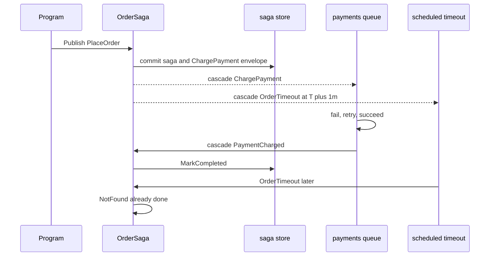

# Learning Hansom

A guided tour through event-driven architecture, using Hansom as the working example. Each section asks a question, answers it briefly, and shows the smallest piece of Hansom code that proves it. Read top-to-bottom, or jump by topic.

If you want a *product* overview — what Hansom is, what's done, what's next — see the [README](README.md).

Open an answer only after you have a guess. If you can explain it to a rubber duck without opening the answer, you have the idea. If you already know **MediatR**, **clean architecture**, and **DDD**, several questions are a translation into this codebase. Frontend stack is out of scope here.

## The basics

What is a message in this project, versus a method call?

A message is a piece of data (a `record` such as `PlaceOrder`) that *might* be handled later, on another thread, after a retry, or after a process restart. Hansom wraps that body in `Message` (`src/Hansom/Domain/Messaging/ValueObjects/Message.cs`): the CLR object, not JSON.

A method call is "run this now, on my stack, throw if it fails." If `OrderSaga.Start` called `ChargePaymentHandler.Handle(...)` directly, you would skip the queue, the retry policy, the inbox, and the chance to load saga state again. Event-driven code decides *what happened* (or what should happen next) and emits a message. It does not reach into the next step.

What is an Envelope, and why isn't the record enough?

Your `record` is the body. Hansom's unit of work is `Envelope`: body plus `EnvelopeId`, `MessageType`, `Destination`, correlation / conversation / saga ids, `SentAt`, `DeliverBy`, `Headers`, `ContentType`, `Attempts`, and `EnvelopeData` (bytes, empty until Serialization).

Retries will reuse the **same** envelope (`Attempts` 1, then 2, then 3). They are not three new publishes. Conversation ids are why a future `TrackActivity` can wait for `PlaceOrder` + `ChargePayment` + `PaymentCharged` as one conversation. The inbox stores envelopes, not bare records, so a restart can continue the same attempt count.

See `src/Hansom/Domain/Envelope/Envelope.cs`.

Why do Message, MessageType, and SagaId live outside Envelope?

Envelope **carries** them. Messaging **defines** the wire name. Sagas **defines** instance identity.

If `MessageType` lived only on Envelope, Messaging would import Envelope for its own core idea (`MessageTypeNaming` returns a name). The wrapper would own the contract. After the move, Envelope depends on Messaging and Sagas. Messaging does not depend on Envelope.

`Message` is the CLR body slot. `MessageType` is the stable string on the wire. `SagaId` is which process-manager instance this envelope belongs to (empty if none). Destination, attempts, and bytes stay on Envelope: those are how *this copy* is sent, retried, and stored.

What does MessageTypeNaming do that the catalog does not?

`MessageTypeNaming.For(Type)` is a pure function: `[MessageIdentity]` alias if present, otherwise `FullName` (not `Name`, not `AssemblyQualifiedName`). It always has a `Type`, so this direction does not fail.

`MessageTypeCatalog` is the map Discovery fills. `Register` records every `(Type, MessageType)` pair (collisions stay on the list for the validator). `_byType` is outbound `GetName`. `_byName` is inbound `Lookup`. Two processes that register the same CLR type must agree on the string.

A dictionary cannot hold two types with the same name. That is why the list is the source of truth.

Why is an unknown wire name a lookup result, not an exception?

A Rabbit payload or inbox row has a string, not a `Type`. `Lookup` returns `KnownMessageType` or `UnknownMessageType`. SerializationPlan: unknown CLR type is a handled failure handed to Execution / `IMissingHandler`, not a crash in the serializer.

`MessageTypeValidator` only says "not empty, not whitespace." "We have never registered this name" is Messaging's job, and it is allowed to fail in a typed way.

Why FullName, not Name or AssemblyQualifiedName?

`Name` alone (`PlaceOrder`) collides across namespaces. `AssemblyQualifiedName` includes the assembly version; bumping a package would change the wire name and break every stored envelope and every other process.

`FullName` is stable across versions. `[MessageIdentity("place-order")]` is the override when you rename the class but must keep the contract.

## The bus

Invoke vs Publish — what is the difference?

Both end up in Execution (envelope, handler, error policy, cascades). They differ in **when the caller continues**.

**`InvokeAsync`** is a function call through the bus. `await` does not finish until that handler returns. Retry-now / retry-with-cooldown happen inside that await. There is no queue in front of the caller. Use Invoke when the current request cannot continue until *this* handler has finished.

**`PublishAsync`** is "accept this envelope and let go." Routing runs, the message lands on a local queue, and the caller is done.

Rule of thumb: **Invoke = I need this handler done before I continue. Publish = I need this work to happen, not necessarily here or now.**

`IMessageBus` does not own threads or sockets. `Mediator` (Invoke) and `LocalQueues` (Publish) implement the difference. See `src/Hansom/Application/Bus/IMessageBus.cs` and `Application/Mediator/Mediator.cs`.

How does this compare to MediatR?

**`InvokeAsync` is MediatR's `Send`.** One message in, handler runs now, caller waits. Hansom finds `Handle(PlaceOrder)` by convention (`Application/Discovery/HandlerConvention`) instead of `IRequestHandler<PlaceOrder>`.

**`PublishAsync` is not MediatR.** The work can retry, land on another thread, or survive a restart. MediatR `INotification` is still not a queue, an outbox, or a saga.

The trap is to `InvokeAsync` the next step from inside a handler (`IMediator.Send` the next command). That keeps you on one stack, with stale saga state, and no outbox. Return `ChargePayment` and let the bus load `OrderSaga` again.

| You know | In Hansom |
| --- | --- |
| `IMediator.Send` / `IRequestHandler<T>` | `InvokeAsync` |
| `IMediator.Publish` / `INotification` | still in-process; not a durable queue |
| "controller calls the next handler" | cascade a message instead |
| One handler, one HTTP request | `PlaceOrder` starts a conversation that outlives the call |

How do handlers get discovered?

`HandlerConvention` (`src/Hansom/Application/Discovery/HandlerConvention.cs`) walks the assemblies you opt into via `HansomOptions.HandlerAssemblies`. It looks for methods named `Handle`, `HandleAsync`, `Start`, or `Consume` on a class and registers each as a candidate handler for the message type the parameter declares. The catalog (`HandlerCatalog`) is a `Type → handlers[]` map the runtime hits on every envelope.

This is reflection at startup, not on the hot path. Perf #1 cached the invoker so the per-call cost is one delegate dispatch.

Why do cascading messages wait for the handler to succeed?

A cascade is a return value the bus publishes **after** the current handler succeeds. `OrderSaga.Start` returns `(saga, OrderTimeout, ChargePayment)`. That is not a call to the payment handler.

If the handler throws, nothing is emitted. That is the in-memory **outbox** (`Application/Cascades`). Durable outbox is the same rule persisted (`Infrastructure/Persistence`). Do not `InvokeAsync` the next saga step from inside a saga handler.

Prove-with: a throwing handler publishes nothing; a succeeding handler publishes exactly its return values, after it returns. See `CascadingMessages` and `ICascadePublisher`.

What is a local queue? Why named payments?

With no RabbitMQ, the bus still has queues: in-process workers. Routing (`Application/Routing`) maps `ChargePayment` → `local://payments/`. LocalQueues (`Infrastructure/LocalQueues`) obey that destination. A worker runs the handler off the caller's thread.

Routing is a table of rules, not a switch inside each handler. The TPL Dataflow block is Infrastructure. `ChargePayment` gets `local://payments/` without the saga naming a queue in `Start`. The attribute is `[LocalQueue("name")]` on the message, or a registration in `RoutingCatalog`.

## Failure and recovery

Why configure retry on the handler instead of a for-loop?

Execution (`Application/Execution/Executor.cs`) wraps one handler call: attempts, retry / retry-with-cooldown / requeue / dead-letter, by exception type and/or message type. `InvokeAsync` only applies retry and retry-with-cooldown (match Wolverine).

A `for` loop inside the handler would block one worker, mix "call the gateway" with "how we recover," and skip dead-letter as a first-class outcome. The policy lives on the chain so every `ChargePayment` gets the same recovery, including inbox recovery after a restart.

The same `Envelope` comes back with `Attempts` 1, 2, 3; then error-queue if the policy says so. See `ErrorPolicyCatalog` in `src/Hansom/Application/Execution/`.

What is a dead-letter?

A dead-letter is the final resting place for a message whose handler has failed permanently. The executor publishes to `IErrorQueue` on exhausted retries. The error queue writes to `IDeadLetterStore` (an inbox/outbox port), so the row can be inspected, replayed, or discarded.

In-memory today (`Infrastructure/Persistence/DeadLetterQueueAdapter.cs`); durable in the PostgreSQL adapter. Ports in `src/Hansom/Application/Persistence/`.

## Time and state

What does the OrderSaga conversation look like end to end?

Read top-to-bottom: `PlaceOrder` starts the saga, the saga cascades the charge and the timeout, the charge retries until it succeeds, the saga marks complete, the late timeout arrives and the saga's `NotFound` swallows it. The `OrderTimeout` is *not* cancelled when the saga completes — EDA assumes messages arrive late, twice, or after the process is over.

Sample code in `samples/Helpdesk/src/Helpdesk.Application/OrderSaga.cs`.

Why is timeout an attribute, not TimeoutMessage or Task.Delay?

Wolverine uses `OrderTimeout : TimeoutMessage(1.Minutes())`. Attribute arguments cannot be `TimeSpan`, so Hansom uses `[Timeout(Minutes = 1)]` on the message type: integers, then `Delay` as `TimeSpan`.

The saga class is inert state (`MarkCompleted` / `IsCompleted`). It does not run a timer. Scheduling sets `Envelope.DeliverBy` from `SentAt + Delay` and parks the envelope until `IMessageScheduler.PlayDue(asOf)`. Tests call `PlayDue` to fast-forward without `Task.Delay`.

`await Task.Delay(1.Minute())` inside `Start` would block a worker, die with the process, and be painful to test.

What is a saga doing that a chain of cascades does not?

Cascades are "after this handler succeeds, emit these messages." There is no state sitting around between them except whatever you put in the message bodies.

A **saga** is state that lives across several messages for one business process: "order 1 is open until paid or until it times out." Domain has identity and `MarkCompleted`. Application/Sagas loads by id, runs `Start` / `Handle` / `NotFound`. Persistence will store the durable row.

Without a saga you could still cascade `ChargePayment`, but you would have nowhere honest to put "this order is still waiting."

Why does NotFound exist? Isn't that just an error?

After payment, `MarkCompleted()` finishes the saga. The timeout scheduled at start is **not cancelled**. A minute later it still arrives.

If there is no `NotFound(OrderTimeout)`, "saga 1 is gone" is a failure. `NotFound` means "this message is harmless because the other path already finished." Same for `PaymentCharged` if the timeout already won.

That is normal in EDA: you design for messages that show up late, twice, or after the process is over. Prove-with: after complete, timeout hits `NotFound` instead of failing.

Why does Saga have no Id? Why is MarkCompleted only a flag?

`OrderSaga` declares `public int? Id { get; set; }`. Other sagas use `Guid` or `string`. An `Id` on the Hansom base would force one CLR type on every saga.

`MarkCompleted()` sets `IsCompleted`. It does not delete a Marten document. Application/Sagas treats the flag as "this instance is finished" (later Handle messages are a unified miss). Persistence owns the durable row. Domain/Sagas is data.

## Architecture

How does this sit with clean architecture (onion) and DDD?

Inner layers do not depend on outer ones. Domain does not know HTTP or Postgres. Application orchestrates. Infrastructure implements ports. Adapters (`Hansom.Postgresql`, `.RabbitMQ`, `.Http`) are separate projects so core cannot take those package references.

- **Messages** are the language of the domain. They are not a controller DTO and not a SQL row.
- **Handlers / saga methods** are use cases. `OrderSaga.Start` must not new up `ChargePaymentHandler`.
- **Helpdesk.Host** is the composition root. Helpdesk.Domain must not reference Hansom.

A **saga is a process manager**, not an aggregate. Hansom's `Saga` does not enforce "an order's line items." It tracks "this instance is open until something calls `MarkCompleted`." The timeout is a message in time, not a `DateTime` field you poll.

This repo is not a full domain model with repositories. The lesson is the messaging shape that DDD + onion usually want, plus a bus you own one folder at a time.

What is a *Plan class? Why empty sealed types with comments?

Each feature folder's `*Plan` is the spec for a slice that may not have runtime types yet: **Put here**, **Do not put here**, **Prove with**. Domain, Discovery, Bus, Mediator, Cascades, Execution, Middleware, and Scheduling used to be Plan-only; they now have real types. The remaining Plans (Logging, Validation, Outbox) describe the next slices.

The empty `sealed class` exists so the folder is a compilable C# project, not a markdown wiki. Implement against the comments. Do not invent a different split.

Why no source generation?

Wolverine's biggest lever is its source generator — it emits handler code at compile time. Hansom uses runtime reflection via `HandlerConvention` instead. Cost: a slightly slower cold start. Benefit: no `InternalsVisibleTo` magic, no generator to learn, the catalog is debuggable in normal C#, and there is one less moving part in `dotnet build`.

If Hansom ever needs the cold-start win, the catalog can be cached to disk and read at startup — without changing the public shape.

How is the slice history kept honest?

The codemap (`codemap.md`, regenerable) records every landed slice with one line of context. Twenty-six slices have landed so far. The slice is the unit of progress, not the commit. Each slice ships with prove-with tests first; the production types follow.

Per project rules: branch from `origin/main`, PR to `main`, never a stacked PR. The codemap is updated in the slice commit, not in a follow-up.

## Adding a feature

How do I add a feature to Hansom?

1. Open (or write) the `*Plan` for the feature folder. Update **Put here** / **Do not put here** / **Prove with** if the spec has changed.
2. Write the prove-with test first. A failing xUnit fact in `tests/Hansom.Tests/<Folder>/`, snake_case name that describes behaviour, small fakes.
3. Implement the smallest type that makes the test pass. Onion rules: Domain does not import Application; Application does not import Infrastructure; `src/Hansom` does not ProjectReference any adapter.
4. Update the codemap with the new slice.
5. Branch from `origin/main`, PR to `main`. No stacked PRs.

If the feature crosses an adapter boundary (Postgres, Rabbit, HTTP), the new code goes in the adapter project, not the kernel.

